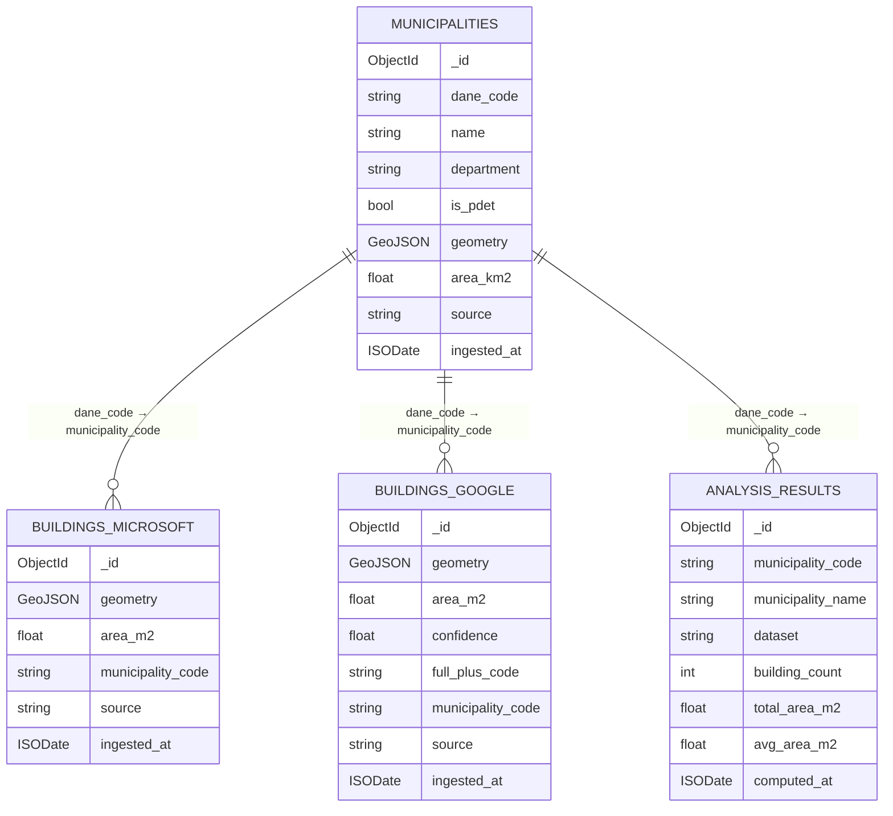
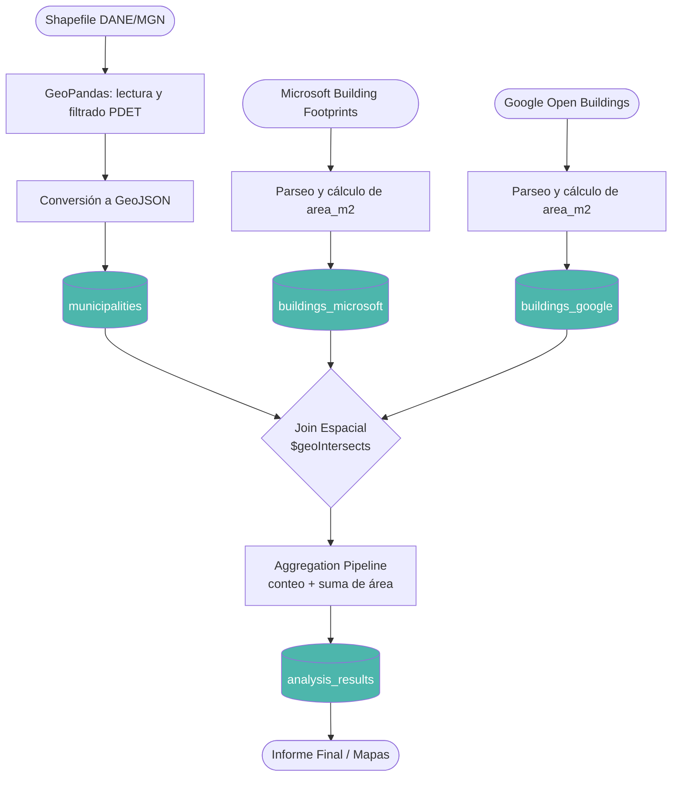
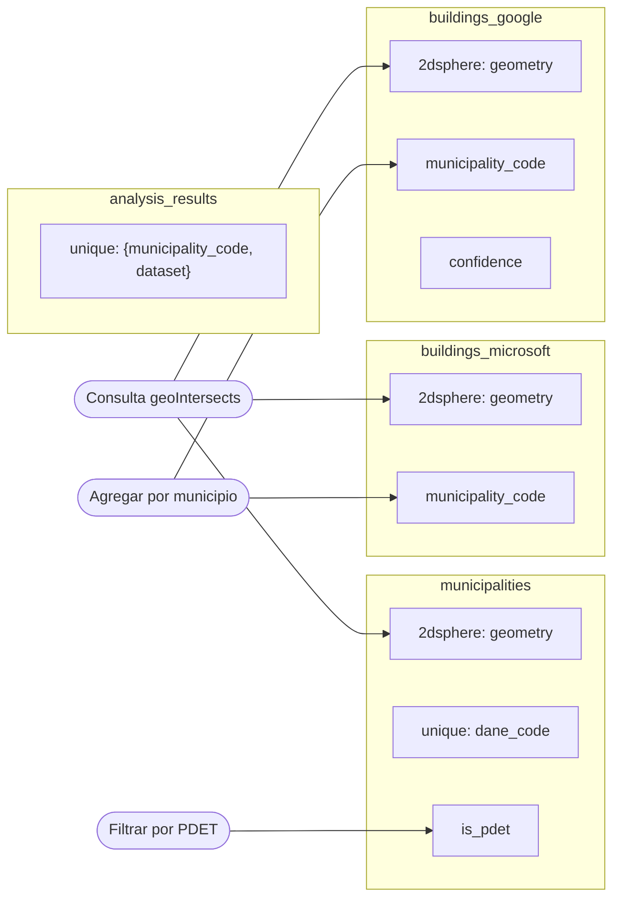
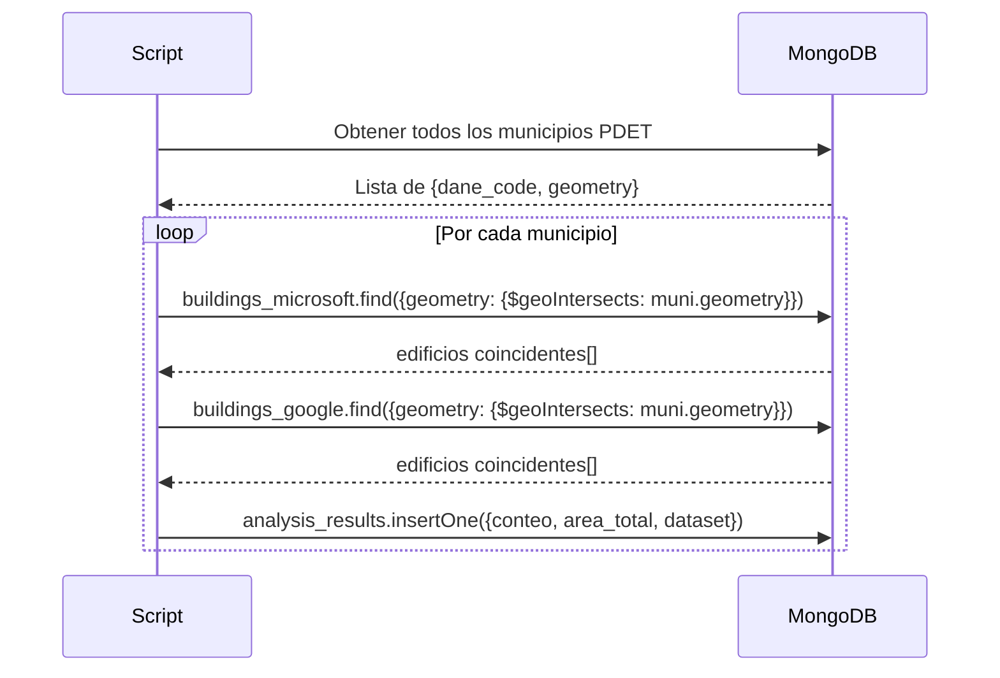

# Proyecto-DBA
Documentación y desarrollo del proyecto para DBA

# Entrega Semana 1 — Diseño del Esquema NoSQL y Plan de Implementación

## 1. Plan de Implementación

### Stack Tecnológico

| Componente | Herramienta | Justificación |
|---|---|---|
| Motor NoSQL | **MongoDB 7.x** | Soporte nativo de GeoJSON, índices 2dsphere, aggregation pipeline |
| Driver Python | **PyMongo / Motor** | Compatible con async, estándar para MongoDB |
| Procesamiento geoespacial | **GeoPandas + Shapely** | Lectura de shapefiles (MGN), conversión a GeoJSON |
| Entorno | **Docker** (imagen mongo:7) | Reproducibilidad del ambiente |
| Control de versiones | **GitHub** | Requerido por el proyecto |

### Cronograma por Semanas

| Semana | Tarea |
|---|---|
| 1 | Diseño del esquema, configuración de MongoDB, creación de colecciones e índices |
| 2 | Carga de límites municipales PDET (MGN/DANE) |
| 3 | Carga de footprints de edificios: Microsoft + Google |
| 4 | Joins espaciales: conteo de edificios y agregación de área por municipio |
| 5 | Informe técnico final |

### Configuración del Entorno

```bash
# Iniciar MongoDB con Docker
docker run -d --name upme-mongo \
  -p 27017:27017 \
  -v $(pwd)/data:/data/db \
  mongo:7

# Instalar dependencias Python
pip install pymongo motor geopandas shapely pandas
```

---

## 2. Modelado de Datos

El modelo se organiza alrededor de cuatro entidades principales:

**Municipios PDET** — polígonos administrativos de DANE/MGN, filtrados a los territorios con estatus PDET. Un documento por municipio.

**Footprints Microsoft** — polígonos de edificios del dataset de Microsoft. Un documento por edificio.

**Footprints Google** — polígonos de edificios de Google Open Buildings. Un documento por edificio. Incluye score de confianza (característica propia de este dataset).

**Resultados de Análisis** — conteos y áreas pre-agregadas por municipio y por dataset, para evitar re-ejecutar joins espaciales costosos.

Todas las geometrías se almacenan como **GeoJSON** (`type: "Polygon"` o `"MultiPolygon"`) para aprovechar los operadores nativos de MongoDB: `$geoIntersects`, `$geoWithin` y `$near`.

---

## 3. Diseño del Esquema

### Colección: `municipalities`

```json
{
  "_id": ObjectId,
  "dane_code": "string",          // Código DIVIPOLA (ej. "05001")
  "name": "string",               // Nombre del municipio
  "department": "string",         // Nombre del departamento
  "is_pdet": true,                // Siempre true tras el filtrado
  "geometry": {                   // GeoJSON Polygon
    "type": "Polygon",
    "coordinates": [[[lon, lat], "..."]]
  },
  "area_km2": 123.45,
  "source": "MGN2025",
  "ingested_at": "ISODate"
}
```

**Índices:**
```javascript
db.municipalities.createIndex({ "geometry": "2dsphere" })
db.municipalities.createIndex({ "dane_code": 1 }, { unique: true })
db.municipalities.createIndex({ "is_pdet": 1 })
```

---

### Colección: `buildings_microsoft`

```json
{
  "_id": ObjectId,
  "geometry": {                   // GeoJSON Polygon
    "type": "Polygon",
    "coordinates": [[[lon, lat], "..."]]
  },
  "area_m2": 87.3,               // Calculado a partir de la geometría
  "municipality_code": "string", // Asignado mediante join espacial (Semana 4)
  "source": "microsoft",
  "ingested_at": "ISODate"
}
```

**Índices:**
```javascript
db.buildings_microsoft.createIndex({ "geometry": "2dsphere" })
db.buildings_microsoft.createIndex({ "municipality_code": 1 })
```

---

### Colección: `buildings_google`

```json
{
  "_id": ObjectId,
  "geometry": {
    "type": "Polygon",
    "coordinates": [[[lon, lat], "..."]]
  },
  "area_m2": 64.1,
  "confidence": 0.87,            // Específico de Google: confianza de detección [0,1]
  "full_plus_code": "string",    // Identificador propio de Google
  "municipality_code": "string",
  "source": "google",
  "ingested_at": "ISODate"
}
```

**Índices:**
```javascript
db.buildings_google.createIndex({ "geometry": "2dsphere" })
db.buildings_google.createIndex({ "municipality_code": 1 })
db.buildings_google.createIndex({ "confidence": 1 })
```

---

### Colección: `analysis_results`

```json
{
  "_id": ObjectId,
  "municipality_code": "string",
  "municipality_name": "string",
  "dataset": "microsoft | google",
  "building_count": 1523,
  "total_area_m2": 98432.5,
  "avg_area_m2": 64.6,
  "computed_at": "ISODate"
}
```

**Índices:**
```javascript
db.analysis_results.createIndex(
  { "municipality_code": 1, "dataset": 1 },
  { unique: true }
)
```

---

## 4. Diagramas

### Diagrama 1 — Esquema de Documentos y Relaciones



---

### Diagrama 2 — Pipeline End-to-End



---

### Diagrama 3 — Estrategia de Índices



---

### Diagrama 4 — Lógica del Join Espacial (preview Semana 4)



---

## 5. Justificación de MongoDB

MongoDB es la opción NoSQL más apropiada para este proyecto por tres razones concretas:

Primero, soporta GeoJSON de forma nativa y los índices `2dsphere` permiten ejecutar operaciones espaciales directamente en la base de datos, sin necesidad de software GIS externo en la fase de análisis.

Segundo, su aggregation pipeline permite calcular conteos y sumas de área en una sola consulta, lo que es eficiente para los volúmenes de datos esperados (cientos de miles de edificios por municipio).

Tercero, el esquema flexible de documentos facilita almacenar los campos propios de cada dataset (por ejemplo, `confidence` de Google o `full_plus_code`) sin forzar un esquema rígido común, lo cual simplifica la integración de múltiples fuentes de datos abiertos.

Alternativas como Apache Cassandra o Amazon DynamoDB no tienen soporte espacial nativo y requerirían procesamientos externos adicionales, contradiciendo el objetivo de simplicidad y reproducibilidad del proyecto.
